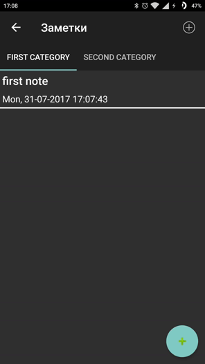

# NotesRealm
____________________________________________

## About

This app made for saving your notes.

Here are all the possibilities:
- create and delete category (tabs with notes)

  

- add notes to category, review them, edit and delete

 

A note contains 3 items: title, id (date created on) and body.

All the data will be saved to the device via [Realm](https://realm.io/) (a mobile database that runs directly inside phones, tablets or wearables).
